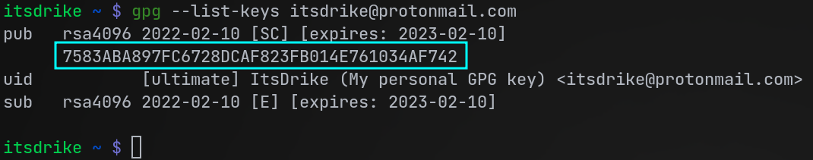

GnuPG (short for GNU Privacy Guard), also known as just GPG is a public-key cryptography implementation. This allows
for a secure transmission of files between parties and can also be used to digitally sign files, to prove that they
weren't modified in any way.

However until somewhat recently, even though I knew that many people used this tool, and I knew what it was doing, I
mostly avoided actually using it because I simply didn't know how to. But over the last few months, I've learned a lot
about how it works internally, and obviously about it's basic usage, and I wanted to share some of this knowledge and
give you a basic guide showing what GPG can do, and perhaps an article which you can quickly refer to if you forget
what command to run for what thing.

## How Public Key Encryption works

In Public Key Encryption, or asymmetric encryption, the issuer creates a key pair, consisting of a public key, and a
private key. As the name would imply, private key is kept to the issuer and should never be exposed, while the public
key should be given to anyone freely.

This kind of structure is very useful, because it allows others to have some information (public key) with which they
can encrypt files in a way that they'll only be decryptable with the private key, which they don't have, so after
deleting the original file, even they wouldn't then be able to decrypt that file, making it safe to have it stored on
their system.

If both parties then create their own key pairs and share the public keys between each other, it allows for a secure
communication between them, even if there were someone monitoring their communication, because both parties only ever
sent the public keys, and while they can be used for encryption, the man in the middle wouldn't be able to decrypt any
sent files.

This also allows the issuer to "sign" a file, creating a unique signature file, which people can check against that
file to confirm it wasn't modified. This signature can only be generated with the issuer's secret/private key, however
anyone with the public key can check that the signature is genuine and was issued by the corresponding private key to
their public one.

In contrast, a symmetric encryption scheme, which is the alternative, is when the involved parties share the same key,
with which they can both encrypt and decrypt files. The disadvantage of this scheme is that if someone is spying on a
conversation already, sending this key to the other party safely isn't possible, and if the attacker gets hold of it,
they can decrypt all sent conversation easily. Symmetric encryption also lacks the possibility of meaningful signature
generation, since to verify the signature, you'd need the single key, and if you did have that key, you could easily
modify the file and sign in with that key, resulting in a perfectly valid signature.

## How to install GPG

If you're on basically any Linux distribution, you'll most likely already have gpg installed, since most package
managers require the packages to be signed by the maintainers, and this is done with the use of GnuPG. But in the
unlikely case that you wouldn't have it installed, you'll probably be able to find it in your package manager, under
`gpg`, or `gnupg` name, if neither works, try adding `2` behind them, signifying the version. If for some reason the
package isn't in the package manager (very unlikely), you can also build it from
[source](https://github.com/gpg/gnupg).

If you're on Windows (why would you do that to yourself?), you can install
[gpg4win](https://www.openpgp.org/software/gpg4win/), which is a ported version of gpg.

## Creating your key

To create your own public-private key pair, you'll need to issue this command:

```sh
gpg --full-gen-key
```

This will ask a few questions, that will configure the key, most notably this will be:

- **Key type** - Which you will most likely want to keep at the default value (RSA and RSA)
- **Key size** - Where you should prefer the biggest possible size (probably 4096 bits), to make brute-force attacks
  really hard
- **Expiration time** - If you want to limit the time your key will be valid for, note that with a private key, this
  time can later be changed, if you need to extend/shorten it.
- **Real name** - your name (it doesn't actually need to be real)
- **Email address** - You should make sure you actually have access to this email, to allow the key to be registered on
  key-servers (I'll describe those later)
- **Comment** - Usually holds the purpose of given key, but can be left empty
- **Passphrase** - Keys with passphrase will require entering this phrase each time the private key will be used (for
  each signature generation, or file decryption). This does add to security, since even if someone got access to your
  files and got the key, it wouldn't be useful without the passphrase. But having to enter a passphrase each time can
  be annoying, ultimately you have to choose if you want convenience, or more security.

After this, GPG will generate the actual keys, containing the configuration you entered using _entropy_. Entropy
describes the amount of unpredictability that exists in your system. This is used to securely generate a random value
(the key), which couldn't easily be reconstructed (computers are generally bad at creating truly random values).

Depending on the key size, this may take a while, though from my experience, it's usually very quick, but some people
do report it taking minutes. If this is your experience, you can try using a tool like `haveged`, which generates
entropy from the CPU timings, or you can just do so yourself, by moving windows around, starting random programs, etc.

## List your key(s)

If you have more keys with the same email in your GPG database, you may need to obtain the key ID instead of simply
using the email to refer to your key in other commands, because the email would now point to multiple keys. To list all
keys with a given email, you can simply run:

```sh
gpg --list-keys [your-email]
```

You can also leave out the email, and just run `gpg --list-keys`, to see all keys that are in your GPG database. This
will likely contain a lot of keys that were added by your package manager, but your key should be present in there too.

If you instead just want to see the keys which you have the secret/private key for (so probably only your own keys),
you can also run `gpg --list-secret-keys`.

The key ID is the long string (probably on the second line), looking like this:



This key ID is safe to share and doesn't expose your private key nor your public key in any way.

## Generate a revocation certificate

After you've made your own private-public key pair, you'll want to make absolutely certain that you also generate a so
called "Revocation certificate". This is a certificate file which you generate using your private key, and it allows
you to immediately prove that you've been in the possession of the private key at some point. When you send this
certificate to others, they can apply it which will immediately revoke your key validity and the key will be considered
no longer valid.

Many people are instead relying on the expiration date to limit the damage, even if an attacker got access to the
private key, however that is not a good solution, because with a private key, it's actually possible to change the
expiration date and content signed with this key with a changed expiration date will be recognized and accepted by the
public key. An expired key isn't safe to dispose of either, since the expiration date can actually be changed even
after that expiration date, giving you a false sense of safety!

You should then make sure that you store your revocation certificate in a separate place, so that if the computer with
the private keys got compromised, and you lost the access to the private key completely, you'll still have a way to
prove that you did have that access at some point, and have a certificate that revokes the validity of that now
compromised key.

To generate this certificate, type:

```sh
gpg --output ./revocation.crt --gen-revoke [key-id]
```

Where the `[key-id]` should be replaced by the unique ID given to this key by GPG. This can also be the email address,
however that's not a good ID if you have multiple generated keys with the same email address (if you enter an email,
matching multiple keys, gpg will show you the possible keys it knows about with that emails, and their IDs).

After that, you'll be asked to confirm that you want to create a revocation certificate, and you'll then be asked for a
reason for the certificate. Since you're making this certificate ahead of time, ideally, you should make one for each
of the scenarios, since the revocation reason will be shown to other users.

## Importing someone else's key

GPG keys can be distributed as files, and you should ask the party you wish to communicate with for their public key,
so that you can import it to generate encrypted messages, that only they can read. Once they give you this key, to
import it you can use this command:

```sh
gpg --import name_of_pub_key_file
```

But files aren't the only way of sharing keys. People often import their keys to "key servers" (I'll explain those
later), if this is the case with your other party, you can get their key simply by searching for it on that key server,
usually by searching for their email address on that key server. You'll also need to know what key server is this the
key stored on. The common ones are: `keys.openpgp.org`, `pgp.mit.edu`, `keyserver.ubuntu.com`, but there are countless
others. To import a key from one of these key servers, you can use:

```sh
gpg --keyserver keys.openpgp.org --search-keys [search parameters]
```

You can replace `[search parameters]` with the email or key's ID, sometimes keyservers also allow searching for user
IDs, or other things, but some keyservers won't support those. (If you want to try this out, you can use
`itsdrike@protonmail.com` on `keys.openpgp.org`)

## Sign the received key

Once you receive someone's key, you should then sign it with your own key, to tell GPG that you do trust that this key
is legitimate and that you've verified it belongs to who it says it does. To do that, you can do:

```sh
gpg --sign-key [key-id]
```

Where, once again, `[key-id]` can be replaced by the received key's email address, or the ID.

Note: You can specify `--local-user [key-id]`/`-u [key-id]` to select which key to sign with, if you don't wish to use
your default key. You can also sign with multiple keys by chaining the option

After you've signed the key, you should help the key's issuer to take the advantage of your signing and send them that
signed version, so that when they're distributing their key to someone else, if that someone already has your key
imported and they trust you, they can find out that you've trusted this key in that it's information (name, email) is
in fact correct.

```sh
gpg --output ./signed-key.key --export --armor [key-id]
```

When they then receive your signed key, they can simply import it back into their database with:

```sh
gpg --import ./signed-key.key
```

## Sharing your keys

Now that you've created your public-private key pair, and managed to import someone else's public key, you'll probably
want to know how to actually share your own keys.

### Sharing public key

For a meaningful communication between you and the other party, just having their public key isn't enough, they also
need to have your public key, so that they can send you encrypted messages that only you can decrypt too. To do this,
you will need to export your private key into a file which you can then send. You can do this with a following command:

```sh
gpg --output ./my-public-key.key --armor --export [key-id]
```

But in most cases, you'll likely want to make your public key available to anyone who wants it, instead of having to
send it individually. You can do this in many ways, for example putting this key file onto your website, but the most
common solution for this is to use a key server. Most key servers have a front-end which you can upload this exported
file to manually, and as a verification that the key does indeed belong to you, you'll be sent an email with some
verification link/token.

Another option is to send the keys to a keyserver directly through GPG, which you can do like this:

```sh
gpg --send-keys --keyserver [keyserver URL] [key-id]
```

Note that keyservers often sync with other trusted keyservers, so if you upload your key to one key-server, it may
actually get shared around across many other keyservers too.

### Sharing a private key

When you're moving to another computer, or you want to work on multiple machines, you may need to have your GPG keys on
both of these machines. This process is pretty similar to exporting a public key, but with private keys, you will need
to be a lot more careful in where you then put this exported file and how you get it into the other machine. This is
because if at any point someone else gets to your private key, you can consider the key as compromised and immediately
issue out your revocation certificate to everyone who currently has your public key on their system and generate a new
key for yourself.

For this reason, whenever you're dealing with an exported secret key, once you've imported it into the other system,
you should immediately shred this file so that it can't be recovered from whatever media you used to transfer it to the
other machine, and if you're transferring over the internet, you should always make sure your connection is end-to-end
encrypted before even considering to send over the exported secret key.

Now that you know the risks, to export a private/secret key, you can run this command:

```sh
gpg --output ./my_private_key.key --export-secret-keys [key-id]
```

Importing it afterwards is quite simple, and uses the same command as importing public keys:

```sh
gpg --import ./my_private_key.key
```

Note that you will want to export both private key, and a public key to then use your key on another machine.

## File encryption with GPG

Now that you've generated your key and exchanged the public parts with the other parties, you can finally actually get
to communicating with the other party in a fully end-to-end encrypted way!

### Encryption

To encrypt a file, we can use this command:

```sh
gpg --armor --encrypt -r [key-id] my_plaintext_file.txt
```

Here, the `[key-id]` points to the recipient's public key id (`-r` stands for recipient), so either an email, or key's
ID directly. This is NOT your key id, it's the recipient's one!

This will generate an encrypted file with the same name as the original, but with an additional extension of `.asc`,
this extension means that we used ASCII readable characters in the encrypted file, instead of raw bytes. If you don't
need this, you can leave out the `--armor` flag, and instead get a file that ends with `.gpg` and contains the raw
bytes after encryption.

We can also include multiple recipients by adding more `-r [key-id]` sequences. With this, we could also include
our public key, to which we have the private key, allowing us to also be able to decrypt it. By default, if we don't
specify our public key in recipients, and the original file was removed, decryption of the original wouldn't be
possible (unless the actual recipient decrypts it for us).

Optionally, if you want to let the recipient know that it was you who encrypted this file, you can also perform signing
on the encrypted result. You can do this separately, following the signing file section, or you can simply include
`--sign` flag when running this command, but note that you may also need `--sign-key [your-key-id]` if you haven't
already specified a signing key in your GPG settings. (More about this in the signing files section).

### Decryption

After you've managed to send an encrypted file to the other party, decryption on their side is very easy. GPG will
automatically detect what key was used to encrypt this file (as long as the key is in GPG's database) and if there's a
private part present for this key, it will decrypt it without needing to manually specify what key to use. All that's
needed is running this command:

```sh
gpg --decrypt encrypted_message.txt.gpg
```

## Signing files

Other than just encryption, GPG also supports so called "signing". This is done to prove that you've verified that
given signed file wasn't tampered with and is legitimate. Signing a file requires a private key, and can then be
verified by anyone with a matching public key. When you create a digital signature file like this, if someone were to
edit the original file, the signature would no longer match to that file, and they wouldn't be able to generate a new
one, at least not without your private key. This is why you see many linux installation media (ISOs) also provide a
signature file, which was signed with the private keys of the maintainers.

### Full signatures

To sign a file, use this command:

```sh
gpg --sign-key [your-key-id] --sign untampered_file.txt
```

Optionally, you can go to you GPG settings at `~/.local/share/gnupg/gpg.conf`, or sometimes in `~/.gnupg/gpg.conf` and
specify the default signing key so you don't need to keep entering the `--sing-key` flag. To do that, just add a line
saying `default-key [key-id]`, note that in this case though, the `[key-id]` should be the actual ID given to the key
by GPG, to avoid any confusion with other keys that may be added later with the same email.

After that, you'll get a signed file, named `untampered_file.txt.gpg`, again, if you want to, you can use ASCII
encoding instead of just raw bytes to make it easier to share the file by simply specifying the `--armor` flag, in that
case, the file will instead end with `.asc`.

At this point, instead of sharing the original file, you can distribute the signed file, however this probably isn't
actually what you'd want, because it would require the recipients to use GPG to get the original file from the signed
version. Instead, what's way more common is to generate a "detached signature", described below.

### Detached signatures

A detached signature is a separate file, which is distributed along with the original file that the signature is for.
This detached signature only contains the actual signature contents, without also including the entire file contents.
That way, people don't need to do any extra work to get the original file out of a full signature file, but it's still
very easy to verify, that the signature does in fact match the distributed file, and that it was signed by a trusted
key. To generate this kind of signature, use this command:

```sh
gpg --sign-key [your-key-id] --detach-sign untampered_file.txt
```

This will now generate the signature file as `untampered_file.txt.sig`, but once again, you can use `--armor` to
instead get `untampered_file.txt.asc` in ASCII encoding.

### Checking the validity of a signature

Any time a file comes with a signature, you'll most likely want to verify that this signature is genuine and that it
does belong to the distributed file, and was made with the trusted key. To do this, you will need the public key part,
with which this signature was generated imported in your gpg database. After that, you can simply run this command:

```sh
gpg --verify untampered_file.txt.sig untampered_file.txt
```

This will show you who is the issuer of this signature, and would fail if it didn't match the given file (second
argument), reporting a BAD signature.

In case you're working with full signatures, instead of a detached signature file and an original (pretty uncommon),
you can simply only use the single full signature file as an argument to the `--verify` flag:

```sh
gpg --verify untampered_file.txt.gpg
```

After that, you'll likely want to extract the original file from the fully signed file, to do that, simply run:

```sh
gpg --output untampered_file.txt untampered_file.txt.gpg
```

## Misc

If you've managed to get all the way to this section, congratulations! You should now know a ton about how basic
asymetric encryption works and what can it do, and also how to utilize it with GPG, to sign files or send encrypted
messages to your friends.

However I wanted to talk a bit more about many different places where GPG is often used, and maybe where you can use
it:

- A very common use-case, which I've already mentioned a bit about is the use in package managers. This is because with
  package managers, it's hard for the owners of these to set up world-wide mirror servers across the entire world and
  maintain each and every one of them, so instead, they rely on other people to set their own mirrors and make them
  accessible to others. However this comes with an obvious risk, and that is that you need to trust the owner of this
  mirror server that they aren't tampering with the packages and putting malware into them. To do that, usually every
  package will be signed with the secret key of the maintainers of this package manager, and building and automatic
  verifier in the package manager, that ensures each package was signed with the correct key, and matches the package.
- Another relatively common practice amongst developers is to sign their git commits. This is done to prove that these
  commits are authentic and in fact made by the correct person. An unsigned commit is not trustworthy, because anyone
  can change their committing email to anything and there's no check ensuring that this email does in fact belong to
  them. However if a commit is signed with a trusted key, and you've verified that this key is authentic and does in
  fact belong to who it says it does, you can then trust all commits signed with this key without worrying they're
  faked.
- Encrypting emails is also very commonly done through GPG, and in fact, a lot of email software (such as Thunderbird)
  include native support for automatic encryption/decryption with GPG. This manual encryption in emails is necessary,
  because the email protocol is very old, and it doesn't actually have any encryption at all. That means that your
  email providers do actually receive your emails unencrypted and can read through all of them! Some providers, such as
  protonmail, do claim that they always store your emails encrypted, which may be true (though you have to trust them
  on it, you can't easily verify this claim), however this encryption only happens after the email is received, so they
  can still capture the contents of your email, even if they can't read the already stored ones (if they do actually
  encrypt them that is).
- Simple file encryption, for example on files that you have on a USB drive which you may worry someone may steal, or
  even for files on your computer directly, if they're sensitive (such as passwords, sensitive documents, ...)
- GPG is also good at generating random sequences from your system's entropy, often used as seeds for pseudo-random
  number generation, or for creation of new keys
- Encrypted full system backups, stored on a cloud. This prevents the cloud provider from getting into your precious
  files stored on your system, but still allows you to keep big backup files on their computer, that you can decrypt
  whenever you'd actually need them

Oh and, in case you'd want to send me something encrypted, feel free to get my public key from `keys.openpgp.org`,
registered under email: `itsdrike@protonmail.com`. You can also get it from my website as a file
[here](https://s.itsdrike.com/gpg).
